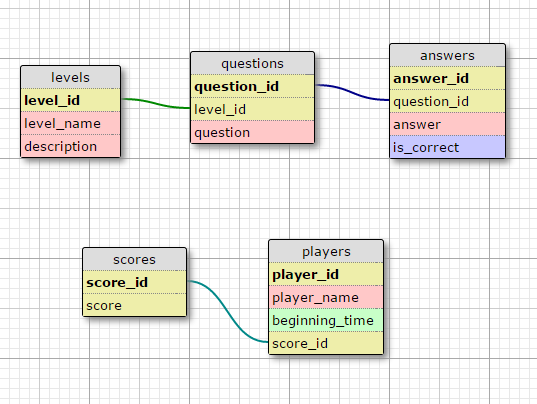

# CodeCamp PostgreSQL: Đặng Đức Vinh + Nguyễn Trung Tuyến

## Đề bài: Thiết kế cơ sở dữ liệu cho ứng dụng game Ai là triệu phú.
Chú ý: Các lệnh truy vấn yêu cầu chỉ sử dụng 1 lệnh để lấy được kết quả theo yêu cầu.
Yêu cầu bài toán:
•	1. Mỗi câu hỏi có 4 đáp án và chỉ có 1 đáp án đúng. Giới hạn độ dài câu hỏi là 150 ký tự, độ dài đáp án là 50 ký tự.
o	1.1 Nhập dữ liệu cho 100 câu hỏi: 20đ
o	1.2. Truy vấn 1 câu hỏi bất kỳ và lấy ra được nội dung câu hỏi, 4 đáp án, đáp án đúng: 5đ
o	1.3. Truy vấn 1 câu hỏi bất kỳ và lấy ra được nội dung câu hỏi, 4 đáp án, đáp án đúng với dữ liệu với nội dữ liệu không trùng nhau (Sử dụng JSON): 5đ
•	2. Có vấn đề mới phát sinh là có phân loại câu hỏi theo 3 mức: Dễ, Trung bình, Khó. 
o	2.1. Hãy cập nhật thông tin bảng với yêu cầu mới thêm (Các bảng trước đó đã có và có dữ liệu): 5đ
o	2.2. Truy vấn số lượng câu hỏi theo mỗi mức độ khó để kiểm tra số lượng câu hỏi cho mỗi mức độ khó đã bằng nhau chưa: 5đ
o	2.3. Truy vấn lấy ngẫu nhiên được 1 câu hỏi thuộc mức độ Dễ (Trung bình, Khó): 5đ
o	2.4. Truy vấn lấy ra ngẫu nhiên 15 câu hỏi và sắp xếp theo thứ tự độ khó tăng dần (mỗi độ khó có 5 câu hỏi sử dụng UNION): 10đ
•	3. Lưu được thông tin cấu hình cho game: Số tiền đạt được ứng với số câu hỏi trả lời được (Ví dụ: trả lời được 1 câu được 500k, 2 câu được 800k, …).
o	3.1. Nhập dữ liệu cấu hình cho game (15 mốc câu hỏi như Ai là triệu phú): 5đ
•	4. Giả lập trợ giúp người chơi (50-50, trợ giúp từ khán giả, gọi điện cho người thân).
o	4.1. Truy vấn lấy được ngẫu nhiên 2 trong số 4 đáp án của 1 câu hỏi bất kỳ, trong đó bắt buộc phải chứa đáp án đúng: 5đ
o	4.2. Truy vấn ngẫu nhiên tỉ lệ khán giả chọn đáp án của 1 câu hỏi theo % (Ví dụ: Đáp án A – 20%, B – 30%, C – 40%, D – 10%): 5đ
o	4.3. Truy vấn ngẫu nhiên đáp án cho 1 câu hỏi: 5đ (Câu hỏi gọi trợ giúp người thân)
•	5. Lưu thông tin người chơi bao gồm: Họ tên, Thời điểm chơi, Số tiền đạt được.
o	5.1. Nhập dữ liệu mẫu 100 người chơi: 5đ
o	5.2. Truy vấn lấy ra 10 người chơi đạt điểm cao nhất, sắp xếp theo thứ tự điểm cao giảm dần (nếu 2 người chơi có cùng điểm số thì người chơi sau sẽ được xếp ở vị trí cao hơn): 5đ
•	6. Quản lý game cần thực hiện các chức năng quản lý:
o	6.1. Tìm kiếm câu hỏi theo id, theo từ khóa trong câu hỏi, theo từ khóa trong câu trả lời. Viết 2 lệnh truy vấn tìm kiếm theo từng cột và theo cả (id, từ khóa trong câu hỏi, từ khóa trong câu trả lời): 5đ
o	6.2. Cập nhật nội dung một câu hỏi, cập nhật nội dung câu trả lời: 5đ
o	6.3. Xóa một câu hỏi: 5đ


* `mkdocs new [dir-name]` - Create a new project.
* `mkdocs serve` - Start the live-reloading docs server.
* `mkdocs build` - Build the documentation site.
* `mkdocs help` - Print this help message.

## Ý tưởng: Thiết lập 5 bảng bao gồm các bảng:
* levels: Lưu trữ cấp độ của các câu hỏi;
* questions: Lưu trữ nội dung các câu hỏi;
* answers: Lưu trữ đáp án của các câu hỏi;
* scores: Lưu trữ mức điểm (tiền thưởng) tương ứng với số câu đạt được dựa trên id;
* players: Lưu trữ thông tin người chơi.

### Các câu lệnh tạo bảng:
## Cấu trúc bảng:
 

## Lệnh tạo bảng

* Bảng levels

```
create table levels (
level_id serial NOT NULL,
name character varying(30) NOT NULL,
description text,
CONSTRAINT levels_pkey PRIMARY KEY (level_id)
)
```

* Bảng questions 

```
create table questions (
question_id serial NOT NULL,
level_id integer NOT NULL,
question character varying(150) NOT NULL,
CONSTRAINT questions_pkey PRIMARY KEY (question_id),
CONSTRAINT questions_level_fkey FOREIGN KEY (level_id) REFERENCES levels (level_id),
description text
)
```

* Bảng answers

```
create table answers (
answer_id serial NOT NULL,
question_id integer NOT NULL,
answer character varying(50) NOT NULL,
is_correct boolean DEFAULT FALSE,
CONSTRAINT answers_pkey PRIMARY KEY (answer_id),
CONSTRAINT answers_question_fkey FOREIGN KEY (question_id) REFERENCES questions (question_id),
description text
)
```

* Bảng scores

```
create table scores (
score_id serial NOT NULL,
score integer NOT NULL,
CONSTRAINT scores_pkey PRIMARY KEY (score_id),
CHECK ( score > 0 )

```

* Bảng players

```
create table players (
player_id serial NOT NULL,
score_id integer,
player_name character varying(100) NOT NULL,
beginning_time timestamp NOT NULL,
CONSTRAINT players_pkey PRIMARY KEY (player_id),
CONSTRAINT players_score_fkey FOREIGN KEY (score_id) REFERENCES scores (score_id)
)
```

### Các lệnh truy vấn:

## 1. Mỗi câu hỏi có 4 đáp án và chỉ có 1 đáp án đúng. Giới hạn độ dài câu hỏi là 150 ký tự, độ dài đáp án là 50 ký tự.

### 1.1 Nhập dữ liệu cho 100 câu hỏi: 20đ

```
CREATE OR REPLACE FUNCTION create_random_questions_with_number(number integer)
RETURNS void AS
$BODY$
DECLARE
  i integer; j integer; random_level integer; random_bool integer; random_question character varying(150); random_answer character varying(50);
BEGIN
  FOR i in 1..$1 LOOP
    random_question = (SELECT md5(random()::text));
    random_level = (select round(random() * ((select max(level_id) from levels)-1) + 1));
    insert into questions (level_id, question) values (random_level,random_question);
    
    random_bool = (select (round(random()*3 + 1) :: integer));
    FOR j in 1..4 LOOP
      random_answer = (SELECT md5(random()::text));
       
      if (j = random_bool) then
        insert into answers (question_id, answer, is_correct) values ((select max(question_id) from questions), random_answer, true);
      else
        insert into answers (question_id, answer, is_correct) values ((select max(question_id) from questions), random_answer, false);
      end if;
    END LOOP;
  END LOOP;
END;
$BODY$
LANGUAGE plpgsql;

select create_random_questions_with_number(100);
```

### 1.2. Truy vấn 1 câu hỏi bất kỳ và lấy ra được nội dung câu hỏi, 4 đáp án, đáp án đúng: 5đ
```
select q.question_id, q.question, a.answer, a.is_correct
from questions as q join answers as a on q.question_id = a.question_id
where q.question_id = (select trunc(random() * ( select count(question_id) from questions) + 1))
```

## 2. Có vấn đề mới phát sinh là có phân loại câu hỏi theo 3 mức: Dễ, Trung bình, Khó. 

### 2.2 Truy vấn số lượng câu hỏi theo mỗi mức độ khó để kiểm tra số lượng câu hỏi cho mỗi mức độ khó đã bằng nhau chưa: 5đ

Function trả về true (bằng nhau) hoặc false (chưa bằng nhau):
```
CREATE OR REPLACE FUNCTION checking_for_balance() RETURNS BOOLEAN AS
$BODY$
DECLARE
x int; y int; z int; level_count int;
BEGIN
level_count = (select count(level_id) from levels);
x = (select count(level_id) from questions where level_id = 1);
FOR i in 2..level_count LOOP
y = (select count(level_id) from questions where level_id = i);
IF x != y THEN
return false;
END IF;
END LOOP;
return true;
END;
$BODY$
LANGUAGE plpgsql;

select checking_for_balance();
```

### 2.3 Truy vấn lấy ngẫu nhiên được 1 câu hỏi thuộc mức độ Dễ (Trung bình, Khó): 5đ
```
select *
from questions
where level_id = (select trunc(random() * ( select count(level_id) from levels) + 1)) limit 1
```

### 2.4 Truy vấn lấy ra ngẫu nhiên 15 câu hỏi và sắp xếp theo thứ tự độ khó tăng dần (mỗi độ khó có 5 câu hỏi sử dụng UNION): 10đ
```
CREATE OR REPLACE FUNCTION random_fifteen_question_and_sort() 
RETURNS TABLE(question_id integer, level_id integer, question character varying(150))
AS $$
DECLARE 
BEGIN
  RETURN QUERY
    (select questions.question_id, questions.level_id, questions.question
    from questions
    where questions.level_id = 1 order by RANDOM() limit 5)

    UNION

    (select questions.question_id, questions.level_id, questions.question
    from questions
    where questions.level_id = 2 order by RANDOM() limit 5)

    UNION

    (select questions.question_id, questions.level_id, questions.question
    from questions
    where questions.level_id = 3 order by RANDOM() limit 5)

    order by level_id ASC;
END;
$$
LANGUAGE plpgsql;

select * from random_fifteen_question_and_sort();
```

## 3. Lưu được thông tin cấu hình cho game: Số tiền đạt được ứng với số câu hỏi trả lời được (Ví dụ: trả lời được 1 câu được 500k, 2 câu được 800k, …)

### 3.1 Nhập dữ liệu cấu hình cho game (15 mốc câu hỏi như Ai là triệu phú): 5đ
```
insert into scores (score) values (500000), (800000), (1500000), (2500000), (4000000), (6000000), (9000000), (12000000), (16000000), (20000000), (25000000), (32000000), (45000000), (70000000), (100000000)
select * from scores
```

## 4. Giả lập trợ giúp người chơi (50-50, trợ giúp từ khán giả, gọi điện cho người thân)

### 4.1 Truy vấn lấy được ngẫu nhiên 2 trong số 4 đáp án của 1 câu hỏi bất kỳ, trong đó bắt buộc phải chứa đáp án đúng: 5đ
```
CREATE OR REPLACE FUNCTION random_two_answer_with_a_correct_answer(question_index integer) 
RETURNS TABLE(answer_id integer, question_id integer, answer character varying(50), is_correct boolean)
AS $$
DECLARE
BEGIN
RETURN QUERY
(select answers.answer_id, answers.question_id, answers.answer, answers.is_correct
from answers where (answers.is_correct = TRUE and answers.question_id = $1))
UNION
(select answers.answer_id, answers.question_id, answers.answer, answers.is_correct
from answers where answers.is_correct = FALSE and answers.question_id = $1
order by RANDOM()
limit 1);
END;
$$
LANGUAGE plpgsql;

select * from random_two_answer_with_a_correct_answer(2)
```

### 4.2 Truy vấn ngẫu nhiên tỉ lệ khán giả chọn đáp án của 1 câu hỏi theo % (Ví dụ: Đáp án A – 20%, B – 30%, C – 40%, D – 10%): 5đ
```
CREATE OR REPLACE FUNCTION random_rating_answers()
RETURNS table (m integer, n integer, p integer, q integer)
AS $$
DECLARE
a integer;b integer;c integer;d integer;

BEGIN
d = 100;
a = round(random() * d);
d = d - a;
b = round(random() * d);
d = d - b;
c = round(random() * d);
d = d - c;
RETURN QUERY
select a,b,c,d;
END;
$$
LANGUAGE plpgsql;

select * from random_rating_answers()
```

### 4.3 Truy vấn ngẫu nhiên đáp án cho 1 câu hỏi: 5đ (Câu hỏi gọi trợ giúp người thân)
```
CREATE OR REPLACE FUNCTION random_answer_for_a_question(question_index integer) 
RETURNS TABLE(answer_id integer, question_id integer, answer character varying(50), is_correct boolean)
AS $$
DECLARE 
BEGIN
RETURN QUERY
select answers.answer_id, answers.question_id, answers.answer, answers.is_correct
from answers
where answers.question_id = $1 
order by RANDOM()
limit 1;
END;
$$
LANGUAGE plpgsql;

select * from random_answer_for_a_question(2) 
```

## 5. Lưu thông tin người chơi bao gồm: Họ tên, Thời điểm chơi, Số tiền đạt được.

### 5.1 Nhập dữ liệu mẫu 100 người chơi: 5đ
```
CREATE OR REPLACE FUNCTION before_add_a_player() RETURNS TRIGGER
LANGUAGE plpgsql
AS $$
BEGIN
NEW.beginning_time = (select now());
return NEW;
END
$$;

CREATE TRIGGER trigger_add_beginning_time_before_insert_player
BEFORE INSERT ON players
FOR EACH ROW
EXECUTE PROCEDURE before_add_a_player(); 


CREATE OR REPLACE FUNCTION random_players(max INTEGER) RETURNS void AS
$BODY$
DECLARE
i int; name character varying(10); random_score_id int;
BEGIN
name = 'player';
FOR i in 1..$1 LOOP
random_score_id = (select trunc(random() * ( select count(score_id) from scores) + 1));
insert into players(player_name, score_id) values (CONCAT(name,i), random_score_id);
END LOOP;
END;
$BODY$
LANGUAGE plpgsql;

select random_players(100);
```

### 5.2 Truy vấn lấy ra 10 người chơi đạt điểm cao nhất, sắp xếp theo thứ tự điểm cao giảm dần (nếu 2 người chơi có cùng điểm số thì người chơi sau sẽ được xếp ở vị trí cao hơn): 5đ
```
select * from players
order by score_id DESC, beginning_time DESC
limit 10
```

## 6. Quản lý game cần thực hiện các chức năng quản lý:

### 6.1 Tìm kiếm câu hỏi theo id, theo từ khóa trong câu hỏi, theo từ khóa trong câu trả lời:
```
select * from questions where question_id = 3
select * from questions where question LIKE '%uo%'
```

### 6.2 Cập nhật nội dung một câu hỏi, cập nhật nội dung câu trả lời: 5đ
```
update questions
set question = 'Nuoc nao co dien tich nho nhat the gioi?'
where question_id = 1

update answers
set answer = 'Nuoc My'
where answer_id = 1 and question_id = 1
```

### 6.3 Xóa một câu hỏi: 5đ
```
CREATE OR REPLACE FUNCTION before_remove_a_question() RETURNS TRIGGER
LANGUAGE plpgsql
AS $$
BEGIN
delete from answers where question_id = OLD.question_id;
return OLD;
END
$$;

CREATE TRIGGER trigger_delete_answers_before_delete_question
BEFORE DELETE ON questions
FOR EACH ROW
EXECUTE PROCEDURE before_remove_a_question();

delete from questions where question_id = 4
```

 -- Lệnh chèn dữ liệu mẫu
 -- Lệnh truy vấn dữ liệu mẫu
 -- Các lệnh query phức tạp

    
